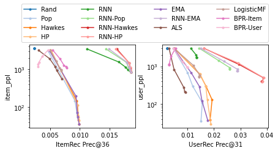

## Recurrent Intensity Model Experiments


Repository to reproduce the experiments in the paper:

Yifei Ma, Ge Liu Anoop Deoras. Recurrent Intensity Modeling for User Recommendation and Online Matching. ICML 2021 Time-Series Workshop.
[link1](http://roseyu.com/time-series-workshop/submissions/2021/TSW-ICML2021_paper_47.pdf)
[link2](https://www.amazon.science/publications/recurrent-intensity-modeling-for-user-recommendation-and-online-matching)


## Getting Started

1. Download and install via `pip install -e .` Additional conda dependencies may be found at [environment.yml](environment.yml)
2. Add data to the [data](data) folder. Some downloading and preparing scripts may be found in [data/util.py](data/util.py).
3. Run experiment as
    ```
    from rime import main, plot_results
    mult=[0, 0.1, 0.2, 0.5, 1, 3, 10, 30, 100]
    self = main("prepare_ml_1m_data", mult=mult)
    fig = plot_results(self)
    ```
    
    ```
    cvx_online = main("prepare_ml_1m_data", mult=mult, cvx=True, online=True)
    fig = plot_results(cvx_online)
    ```
    
4. To extend to other datasets, see example in [prepare_synthetic_data](src/rime/dataset/__init__.py)
5. The provided examples are tested in [test](test).

## Development

Please visit latest API reference at [ReadTheDocs](https://recurrent-intensity-model-experiments.readthedocs.io/).

## Security

See [CONTRIBUTING](CONTRIBUTING.md#security-issue-notifications) for more information.

## License

This project is licensed under the Apache-2.0 License.

